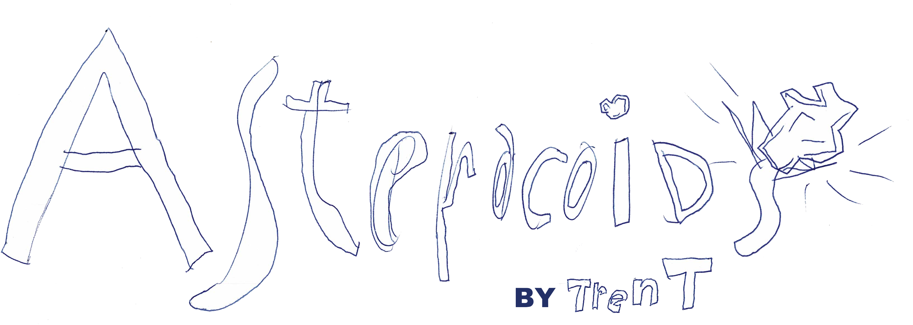

# Asteracoids
The classic asteroids game in pygame. Design by my very strict 11 year old product owner. The goal of this project is to showcase pygame and class hierarchy in a game for the Rotterdam Academy.

It might look like a simple game, but Asteroids has some mechanics that I found complicated. Things to consider before diving into this code: 
- Objects wrap around the screen. If you exit left, you should appear on the right side.
- Objects move in angles, so you'll need to work with vectors (ie. angle and speed), which is harder then doing just x,y speeds. Trigonometry is actually a useful class. 
- The player ship rotates and rotation in pygame is a two part problem - you have to rotate both the image and the actual object.

# Class description
| Class | Parent | Role |
| --- | --- | --- | 
| GameConfig |  | This is a python dataclass that holds all the game variables. If you want to tune any of the parameters do it here. If you are not familiar with dataclasses, see this [great explanation](https://stackoverflow.com/questions/47955263/what-are-data-classes-and-how-are-they-different-from-common-classes) | 
| GameSetup |  | I seperated the bootstrapping stuff like showing the screen from the game logic. This class contains the meta things and should be responsible for starting and stopping | 
| AsteracoidsGame |  | The class that handles the game logic and game objects. This implements the state pattern, with a state for title screen, the actual game and the "game over". As pygame goes , every game frame has a setup phase ("updates") and a drawing phase ("draws") | 
| Mobile | pygame.sprite.Sprite | In asteroids all objects on the screen have to deal with movement and with screen wraparound. This class assumes every object to have an angle and speed which can be managed in the subclasses | 
| Player | Mobile | The player ship. It has some interesting rotation mechanics (as rotation is HARD in pygame) and handles button pushes | 
| Asteroid | Mobile | The flying blocks. You shoot them, they break.  |
| Levels |  | Every asteroid is initiated with a level object for setting up the number of times it breaks, how many pieces, scale of the asteroid etcetera. | 
| Missile | Mobile | You shoot, it flies. As this follows the same rules as the player ship and asteroids (ie. it has a speed and an angle and it wraps around the screen) it inherits most movement related methods from the Mobile class.  |
| TextRender | | A simple text writing class to put text on the screen | 
| Scorer | | Code that keeps track of your score |   
